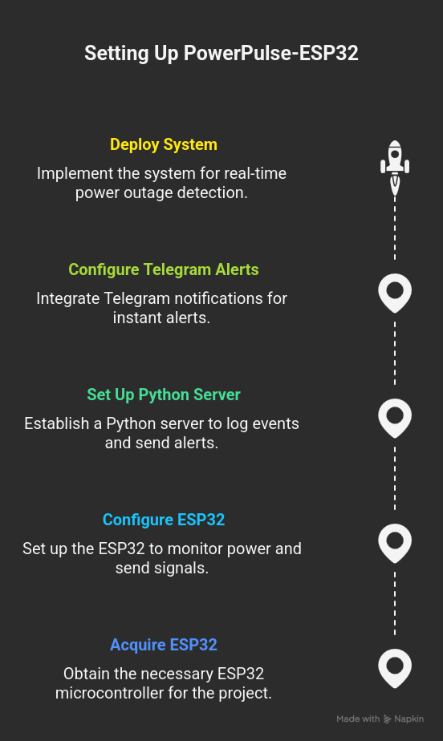

# ⚡ PowerPulse-ESP32

<div align="center">

[](LICENSE)
[](https://github.com/h4ndsh/PowerPulse-ESP32/stargazers)
[](https://github.com/h4ndsh/PowerPulse-ESP32/network)

**A system for detecting power outages using an ESP32 and Python server, with Telegram alerts.**

</div>

## 📖 Overview

**PowerPulse-ESP32** is a system designed to **detect power outages** in real time. It uses an **ESP32 microcontroller** to monitor if the electricity in a house goes down and a **Python server** to log events and send alerts.  

Whenever a power outage occurs, the system sends **instant Telegram notifications** to configured chats, enabling fast awareness and response.  

The ESP32 operates as a client, sending regular **heartbeat** signals to the server, ensuring continuous monitoring.


<div align="center">
  
</div>


## ✨ Features

- Real-time detection of power outages via ESP32.
- Instant Telegram alerts for power failures.
- Simple and easy-to-deploy architecture.
- Heartbeat-based monitoring to ensure reliable operation.

## 🛠️ Tech Stack

**Backend:**

- Python

**Embedded:**

- ESP32 Microcontroller

## 🚀 Quick Start

This project requires an **ESP32 microcontroller** and a system capable of running the Python server.

### Prerequisites

- Python 3.x (version compatible with libraries in `requirements.txt`)
- ESP32 development environment (Arduino IDE recommended)
- `pyserial` Python library

### Installation

#### 1. Clone the repository
```bash
git clone https://github.com/h4ndsh/PowerPulse-ESP32.git
cd PowerPulse-ESP32
```

#### 2. Install Python dependencies (Server)
```bash
pip install -r requirements.txt
```

#### 3. Configure environment variables
- Copy `.env.example` to `.env` and fill in:
  - `SERIAL_PORT`: IP and PORT
  - `TELEGRAM_CHAT_IDS`: Comma-separated chat IDs for alerts
  - Any other relevant settings

#### 4. ESP32 Setup (MicroPython)
- Open the `esp32` folder.
- Select the correct **board** (ESP32) and **serial port**.
- Upload the sketch to the ESP32.

#### 5. Run the Python server
```bash
python server.py
```
- The server will start listening for heartbeat signals from the ESP32.
- Telegram alerts will be sent whenever a power outage is detected.

### Testing (`client.py`)
`client.py` is a simple test script to simulate ESP32 heartbeats:

```bash
python client.py
```

- Use this script to verify server connectivity, logging, and Telegram alerts without needing the ESP32.

## 📁 Project Structure

```
PowerPulse-ESP32/
├── .env.example
├── .gitignore
├── LICENSE
├── client.py          # Test script for server communication
├── esp32/             # ESP32 firmware (Arduino sketches)
├── heartbeat.service  # Optional systemd service for Linux
├── requirements.txt
└── server.py          # Main Python server
```

## 🔧 Development

- Modify ESP32 firmware or server code as needed.
- Restart the server to apply changes.
- Verify heartbeat signals and alerts.

## 🧪 Manual Testing

1. Verify ESP32 is sending heartbeat signals to the server.
2. Run `client.py` to simulate heartbeats.
3. Disconnect the power source to test Telegram outage alerts.
4. Check server logs for correct detection and alert timestamps.

## 🚀 Deployment

- Deploy the Python server to a suitable machine.
- Configure the ESP32 on the target hardware with proper network settings.
- Optionally, enable `heartbeat.service` to run the server in the background on Linux.

## 📄 License

This project is licensed under the **Apache License 2.0** - see the [LICENSE](LICENSE) file for details.

---

<div align="center">

**Made with ❤️ by h4ndsh**

</div>
